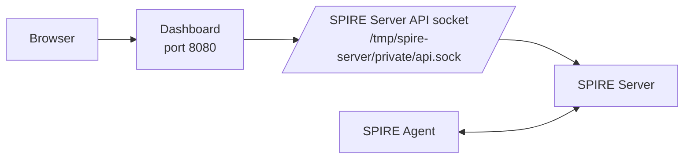

# Scenario 02 -- SPIRE Dashboard

> **Complexity:** Beginner - **Previous:** [01-simple](../01-simple/README.md) - **Next:** [03-workload](../03-workload/README.md)

## What You Will Learn

This scenario keeps the same join-token-based SPIRE deployment from Scenario 01, but adds a **read-only web dashboard** for browsing SPIRE resources. It is the first scenario where you can inspect the SPIRE deployment visually instead of relying only on CLI commands.

By the end of this scenario you will understand:

- how the SPIRE Server exposes a management API via a Unix socket
- how a Go service can query agents, entries, and trust bundles through gRPC
- how to inspect SPIRE state from a browser

## What Is the Dashboard?

The dashboard is a single Go binary that connects to the SPIRE Server API socket and serves read-only HTML pages. It does not replace SPIRE Server or SPIRE Agent. It sits beside the SPIRE Server and uses the server API socket to query SPIRE state.

- **SPIRE Server** remains the authority that stores registration entries and signs identities.
- **Dashboard** translates browser requests into SPIRE Server gRPC API calls and renders the results as HTML.

## Architecture



The important detail is the shared socket volume at `/tmp/spire-server/private/api.sock`:

1. the SPIRE Server creates the Unix socket
2. the dashboard mounts the same volume
3. the dashboard uses that socket to query SPIRE data via gRPC
4. the browser loads HTML pages from the dashboard

## Files in This Scenario

- `compose.yml` -- starts SPIRE Server, SPIRE Agent, and the dashboard
- `spire/server/server.conf` -- SPIRE Server configuration using join token attestation
- `spire/agent/agent.conf` -- SPIRE Agent configuration
- `scripts/env-up.ps1` -- builds the dashboard, starts SPIRE, waits for readiness
- `scripts/env-down.ps1` -- stops and removes the scenario containers and volumes

## Running the Scenario

Open a PowerShell terminal in `scenarios\02-dashboard\` and run:

```powershell
.\scripts\env-up.ps1
```

The script performs these steps for you:

1. builds the dashboard container image
2. starts the SPIRE Server
3. waits for the server to pass its healthcheck
4. generates a one-time join token
5. starts the SPIRE Agent with that token
6. waits for agent attestation to complete
7. starts the dashboard
8. waits for the dashboard to respond

## Access the Dashboard

Once startup finishes, open your browser at:

- **Dashboard**: http://localhost:8080

## What You Can See

After opening the dashboard, explore these pages:

### Overview

Shows server health status, number of agents and entries, and the trust domain name.

### Agents

View the attested SPIRE Agent from this scenario. This helps make node attestation visible without running `spire-server agent list` manually.

### Entries

Browse workload registration entries. Later scenarios will make this view much more interesting as more workloads appear.

### Trust Bundle

Inspect the trust bundle for the `mirmat.org` trust domain. This reinforces that SPIFFE identity is rooted in a trust domain, not in container names or IP addresses.

## Why This Scenario Matters

The dashboard does not change SPIFFE or SPIRE fundamentals, but it makes them easier to see:

- you can verify that the agent really attested
- you can inspect SPIRE state without memorizing CLI commands
- you get a clearer mental model before moving on to workload identity and more advanced scenarios

## Cleanup

When you are done:

```powershell
.\scripts\env-down.ps1
```

---

**Previous:** [01-simple](../01-simple/README.md) | **Next:** [03-workload](../03-workload/README.md)
