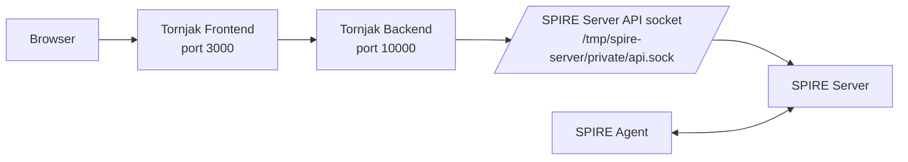

# Scenario 02 — Tornjak UI for SPIRE

> **Complexity:** Beginner · **Previous:** [01-simple](../01-simple/README.md) · **Next:** [03-workload](../03-workload/README.md)

## What You Will Learn

This scenario keeps the same join-token-based SPIRE deployment from Scenario 01, but adds **Tornjak**, a web UI and API layer for browsing and managing SPIRE resources. It is the first scenario where you can inspect the SPIRE deployment visually instead of relying only on CLI commands.

By the end of this scenario you will understand:

- what Tornjak is and where it fits in a SPIRE deployment
- how Tornjak talks to the SPIRE Server through the server API socket
- how the frontend and backend are separated
- how to inspect agents, registration entries, and trust data from a browser

## What Is Tornjak?

[Tornjak](https://github.com/spiffe/tornjak) is a management UI and API for SPIRE. It does not replace SPIRE Server or SPIRE Agent. Instead, it sits beside the SPIRE Server and uses the server API socket to expose a friendlier HTTP interface and browser-based UI.

That means Tornjak is an **observability and management layer**, not a new trust root.

- **SPIRE Server** remains the authority that stores registration entries and signs identities.
- **Tornjak Backend** translates browser/API requests into SPIRE Server API operations.
- **Tornjak Frontend** provides the web UI you open in your browser.

## Architecture



The important detail is the shared socket volume at `/tmp/spire-server/private/api.sock`:

1. the SPIRE Server creates the Unix socket
2. the Tornjak backend mounts the same path
3. the backend uses that socket to query and manage SPIRE data
4. the frontend calls the backend over HTTP

## Files in This Scenario

- `compose.yml` — starts SPIRE Server, SPIRE Agent, Tornjak backend, and Tornjak frontend
- `spire/server/server.conf` — SPIRE Server configuration using join token attestation
- `spire/agent/agent.conf` — SPIRE Agent configuration
- `tornjak/tornjak.conf` — Tornjak backend configuration
- `scripts/env-up.ps1` — starts SPIRE first, then Tornjak, and waits for readiness
- `scripts/env-down.ps1` — stops and removes the scenario containers and volumes

## Running the Scenario

Open a PowerShell terminal in `scenarios\02-tornjak\` and run:

```powershell
.\scripts\env-up.ps1
```

The script performs these steps for you:

1. starts the SPIRE Server
2. waits for the server to pass its healthcheck
3. generates a one-time join token
4. starts the SPIRE Agent with that token
5. waits for agent attestation to complete
6. starts the Tornjak backend and frontend
7. waits for the Tornjak API to respond

## Access the UI

Once startup finishes, open your browser at:

- **Tornjak UI**: http://localhost:3000
- **Tornjak API**: http://localhost:10000

## What You Can Do in Tornjak

After opening the UI, explore these areas:

### Agents tab

View the attested SPIRE Agent from this scenario. This helps make node attestation visible without running `spire-server agent list` manually.

### Entries tab

Browse workload registration entries and create new ones through the management interface. Later scenarios will make this view much more interesting as more workloads appear.

### Trust Domains tab

Inspect the trust bundle for the `mirmat.org` trust domain. This reinforces that SPIFFE identity is rooted in a trust domain, not in container names or IP addresses.

## Why This Scenario Matters

Tornjak does not change SPIFFE or SPIRE fundamentals, but it makes them easier to see:

- you can verify that the agent really attested
- you can inspect SPIRE state without memorizing CLI commands
- you get a clearer mental model before moving on to workload identity and more advanced scenarios

## Cleanup

When you are done:

```powershell
.\scripts\env-down.ps1
```

---

**Previous:** [01-simple](../01-simple/README.md) | **Next:** [03-workload](../03-workload/README.md)
