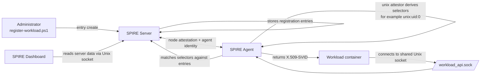

# Scenario 03 — Workload Identity

> **Complexity:** Beginner-Intermediate - **Previous:** [02-dashboard](../02-dashboard/README.md) - **Next:** [04-tpm](../04-tpm/README.md)

## What You Will Learn

This scenario introduces the moment where SPIRE becomes useful to applications: issuing identities to workloads. You will learn how a SPIRE administrator registers a workload, how the SPIRE Agent attests that workload at request time, and how the workload fetches its X.509-SVID from the Workload API without managing certificates directly.

By the end of the scenario you will understand:

- how registration entries map a SPIFFE ID to selectors
- how the `unix` workload attestor derives selectors from process metadata
- how a workload reaches the Workload API through the shared agent socket
- how SVID issuance and rotation are handled by SPIRE instead of by the application

## Background Concepts

### Workload Registration

A workload does not automatically receive an identity just because it can reach the SPIRE Agent. An administrator must first create a registration entry on the SPIRE Server. That entry binds three important things together:

1. the SPIFFE ID that should be issued
2. the parent identity that is allowed to request it
3. one or more selectors that describe the workload

In this scenario the registration happens with `spire-server entry create`. The entry says: when the attested agent identified by the given `parentID` asks for a workload whose selectors include `unix:uid:0`, issue `spiffe://mirmat.org/myworkload`.

### Workload Attestation

When a workload calls the Workload API, the SPIRE Agent does not blindly hand out certificates. Instead, it runs one or more WorkloadAttestors to learn facts about the calling process. Those facts become selectors such as UID, GID, PID, container metadata, or Kubernetes attributes depending on the attestor in use.

The agent compares the discovered selectors with registration entries stored on the SPIRE Server. If there is a match, the workload is authorized and receives an SVID. If there is no match, the request is denied.

### The Unix Attestor

This scenario uses the `unix` workload attestor because it is easy to understand and works well in a simple containerized lab. The attestor inspects Unix process metadata from the peer connected to the Unix domain socket.

Common selectors include:

- `unix:uid:<value>`
- `unix:gid:<value>`

Our workload container runs as root by default, so the selector we register is `unix:uid:0`. That is why the workload can fetch an SVID once the registration entry exists.

### SVID Lifecycle

An SVID is a verifiable identity document. In the X.509 case it is a short-lived certificate containing the workload's SPIFFE ID in the URI SAN. SPIRE intentionally keeps these credentials short-lived so compromise windows are small.

The important operational point is that the workload does not create, sign, rotate, or renew the certificate itself. The workload simply connects to the Workload API and asks for identity material. The SPIRE Agent handles issuance and rotation behind the scenes.

### The Workload API

The Workload API is the standard SPIFFE API that workloads use to fetch identities and trust bundles. In this scenario it is exposed by the SPIRE Agent over a Unix domain socket at `/opt/spire/sockets/workload_api.sock`.

The workload container does not run its own SPIRE Agent. Instead, it shares the socket through the named volume `shared-socket`. Because the scenario uses the `unix` workload attestor, the workload container also joins the agent container PID namespace (`pid: "container:workload-spire-agent"`) so the agent can inspect caller process metadata correctly. That shared socket is the key teaching point of the scenario: the workload gains access to the Workload API, not to the server database or the server API.

## Architecture Diagram



## Prerequisites

- Podman and `podman-compose`
- PowerShell 7+

## Running the Scenario

Open a PowerShell terminal in `scenarios\03-workload\` and run the following steps.

### 1. Start the server, attest the agent, and launch the workload

```powershell
.\scripts\env-up.ps1
```

What this script does:

- builds the local SPIRE dashboard image
- starts the SPIRE Server
- generates a join token for the agent
- starts the SPIRE Agent with that token
- waits until the agent is successfully attested
- starts a separate workload container that watches the Workload API through the shared socket and joins the agent container PID namespace for `unix` attestation
- starts the SPIRE dashboard on port 8080
- shows the attested agent on the server

### 2. Register the workload

```powershell
.\scripts\register-workload.ps1
```

This creates a registration entry with:

- **SPIFFE ID:** `spiffe://mirmat.org/myworkload`
- **Parent ID:** the attested agent discovered from `agent list`
- **Selector:** `unix:uid:0`

This is the policy step. Until this entry exists, the workload has access to the socket but is not authorized to receive an identity.

### 3. Display the workload SVID

```powershell
.\scripts\fetch-svid.ps1
```

The workload container started earlier is already watching the Workload API over the shared socket. After the registration entry exists, the SPIRE Agent evaluates the caller, matches the `unix:uid:0` selector, and streams the X.509-SVID for `spiffe://mirmat.org/myworkload` to that workload. This script prints the successful fetch from the workload container logs.

## Inspecting the SVID

The fetch output is already useful for learning because it shows the issued identity material and proves that the Workload API request succeeded. When reading the output, pay attention to:

- the SPIFFE ID in the certificate
- the certificate validity window
- the certificate chain returned by SPIRE

If you want PEM files for further inspection, you can run a fetch command with `-write`. The generated files live inside the workload container or shared volume, so copy them to a location with OpenSSL access before inspecting them on the host.

```powershell
podman-compose exec workload /opt/spire/bin/spire-agent api fetch x509 `
    -socketPath /opt/spire/sockets/workload_api.sock `
    -write /opt/spire/sockets/myworkload
```

A typical follow-up inspection command is:

```powershell
openssl x509 -in myworkload_svid.pem -text -noout
```

Look for the URI Subject Alternative Name containing `spiffe://mirmat.org/myworkload`.


## SPIRE Dashboard

The SPIRE dashboard is co-deployed as a management UI alongside the SPIRE server. Once the scenario is running, open your browser at:

- **Dashboard**: http://localhost:8080

From the dashboard you can:
- view all attested agents
- browse workload registration entries
- inspect trust domain data

This makes the SPIFFE/SPIRE configuration visible without requiring CLI commands.

## Cleanup

When you are done, stop and remove the containers and volumes:

```powershell
.\scripts\env-down.ps1
```

---
**Next:** [04-tpm](../04-tpm/README.md)
