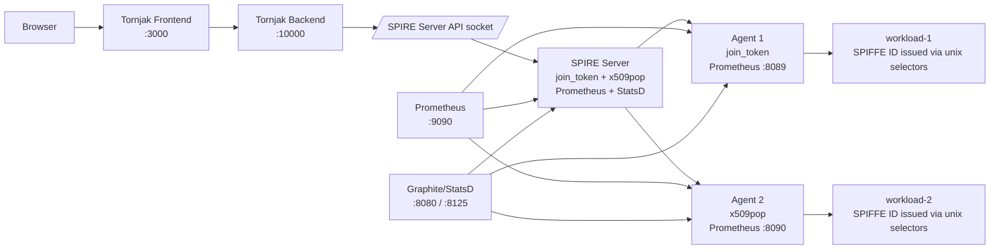

# Scenario 07 — Production-Like SPIRE Platform

> **Complexity:** Advanced · **Previous:** [06-metrics](../06-metrics/README.md) · **Status:** Final scenario

## What You Will Learn

This final scenario combines the major ideas from the rest of the demo into one environment that looks much closer to a real platform deployment:

- two different node attestation methods in one trust domain
- multiple agents serving different workloads
- workload registration and issuance across those agents
- Tornjak for management visibility
- Prometheus and Graphite/StatsD for telemetry

The goal is not to reproduce every production detail, but to show how the concepts fit together when a deployment grows beyond a single server and a single agent.

## Architecture Overview



## What Makes It “Production-Like”?

### Two attestation methods at once

- **Agent 1** uses the simple lab-friendly `join_token` flow.
- **Agent 2** uses `x509pop`, which stands in for stronger device-backed identity.

This shows that a single SPIRE Server can accept more than one node attestation strategy.

### Separate workloads per agent

Each agent has its own workload socket volume and its own demo workload container. This makes it easy to see which workload belongs to which agent and which parent ID each registration entry must use.

### Management + telemetry together

Tornjak gives you human-friendly visibility into SPIRE state, while Prometheus and Graphite give you operational telemetry. In real environments you usually want both.

## Files in This Scenario

- `compose.yml` — full platform stack
- `spire/server/server.conf` — server with `join_token`, `x509pop`, Prometheus, and StatsD telemetry
- `spire/agent-1/agent.conf` — join-token agent with telemetry enabled
- `spire/agent-2/agent.conf` — x509pop agent with telemetry enabled
- `tornjak/tornjak.conf` — Tornjak backend configuration
- `prometheus/prometheus.yml` — scrapes server plus both agents
- `scripts/provision-agent.ps1` — generates x509pop credentials for agent 2
- `scripts/register-workloads.ps1` — registers one workload under each attested agent
- `scripts/env-up.ps1` — orchestrates the full startup order

## Running the Scenario

From `scenarios\07-production\`, run:

```powershell
.\scripts\env-up.ps1
```

The startup script does the following:

1. provisions x509pop credentials for agent 2 if they are missing
2. starts Graphite/StatsD and Prometheus
3. starts the SPIRE Server and waits for health
4. generates a join token for agent 1
5. starts agent 1 (`join_token`) and agent 2 (`x509pop`)
6. waits until both agents appear on the SPIRE Server
7. starts one workload for each agent
8. registers workload entries for both workloads
9. starts Tornjak and waits for the backend API to respond

## Access the Services

Once startup completes, open these endpoints:

- **Tornjak UI**: http://localhost:3000
- **Tornjak API**: http://localhost:10000
- **Prometheus**: http://localhost:9090
- **Graphite**: http://localhost:8080

## What to Observe

### In Tornjak

- two attested agents with different attestation types
- registration entries for `spiffe://mirmat.org/workload-1` and `spiffe://mirmat.org/workload-2`
- the trust bundle for the `mirmat.org` trust domain

### In Prometheus

Look at the targets page first. You should see scrape targets for:

- `spire-server:8088`
- `spire-agent-1:8089`
- `spire-agent-2:8090`

That confirms telemetry is enabled across the whole platform.

### In Graphite

After the workloads and registrations are active, Graphite/StatsD should begin receiving counters and gauges from the SPIRE components.

## Suggested Experiments

1. Open Tornjak and compare the parent IDs for the two workload entries.
2. Use Prometheus to inspect metrics for server and agent startup, SVID issuance, and workload API activity.
3. Re-run the scenario after deleting agent 2 certificates to observe automatic reprovisioning.
4. Modify the registration selectors and observe how workload issuance changes.

## Cleanup

When you are done:

```powershell
.\scripts\env-down.ps1
```

---

**Previous:** [06-metrics](../06-metrics/README.md) · **Last scenario**
